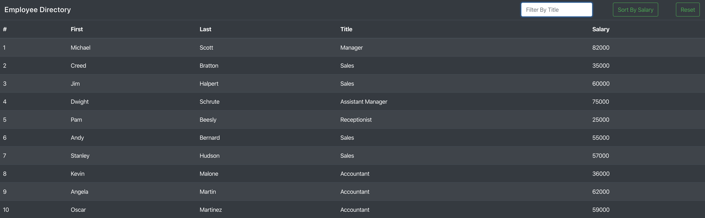

# Employee Directory
## Created by: bg9892

## Index
1. [Description](#description)
2. [Installation](#installation)

### Deployed App

### Description
Employee tracker app that show a list of employees, titles, and salaries. You can filter by title and sort by salary.

### Installation
npm install
run npm start

# Screenshots

